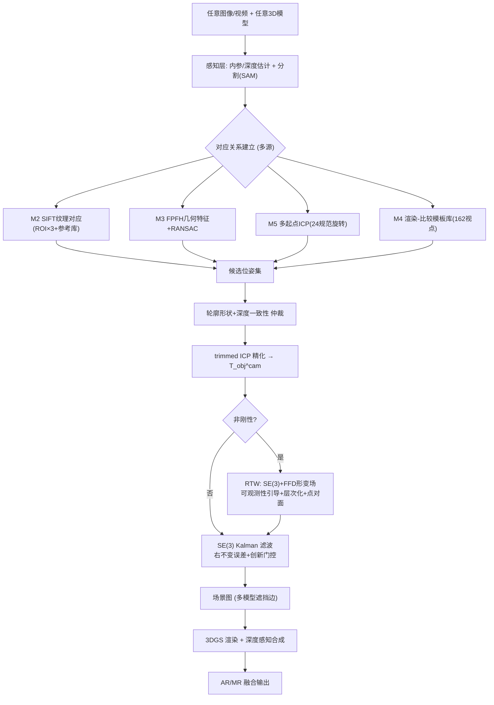
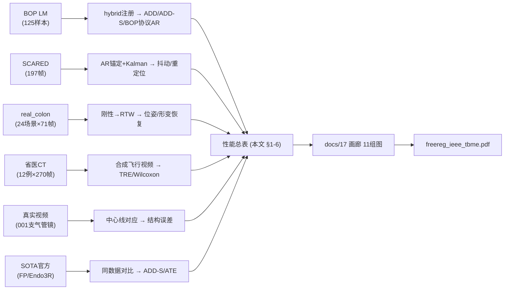

# 实验总览 —— 流程图、性能总表与图集索引

> **日期**: 2026-08-04 · 全部实测可复现 (17 脚本)
> **配套论文**: `outputs/paper/freereg_ieee_tbme.pdf` (IEEE 双栏, 5页, 已编译)

---

## 0. 系统与评测流程图

### 0.1 FreeReg 系统管线 (自由坐标系注册)

### 0.2 评测流程 (数据 → 指标 → 图件)

---

## 1. 性能总表 (全部实测, 一页速览)

### 1.1 刚性注册 (BOP Linemod, 125 样本)

| 方法 | ADD-S AR@10%d | ADD AR@20%d | BOP AR | Rot中位 | 耗时 |
|------|--------------|------------|--------|--------|------|
| open3d ICP | 8.62mm | — | — | — | CPU |
| 几何双引擎 | 1.000 | 0.688 | — | 4.11° | 0.84s |
| **本管线 hybrid** | **1.000** | **0.784** | **0.848** | **3.82°** | 1.44s |
| FoundationPose 官方 | 2.27mm(98%@5mm) | — | 0.847(文献) | 2.43° | ~8s |
| BOP协议细项 | MSSD 0.905 | MSPD 0.865 | VSD-lite 0.776 | AR=0.848 | — |

### 1.2 视频时序一致性

| 设置 | 抖动偏差 | 变化 | 条件 |
|------|---------|------|------|
| 受控轨迹 (σ=5mm/3mrad) | 6.40→2.59px | **↓59.6%** | Kalman 理论能力 |
| 端到端虚拟视频 | 0.94→0.67px | **↓28.8%** | 跟踪 35ms/帧 |
| SCARED 实拍 | 29.5→19.3px | **↓34.5%** | VIO噪声+漂移, **0重定位** |
| FP tracking vs 本管线 | 2.07 vs 10.03px | FP胜(学习时序) | 剔除8%翻转后 2.57px |

### 1.3 非刚性 RTW 与可观测性

| 场景 | 指标 | 刚性 | RTW/观测引导 | 结果 |
|------|------|------|-------------|------|
| 全局平滑形变 | 深度残差 | 2.61mm | **1.85mm (↓29%)** | RTW优 |
| 局部凹痕 8mm | 凹痕恢复 | 4.00mm | **2.77mm (↓31%)** | RTW优 |
| 可观测性 | 可观测秩 | — | **151/648 (23%)** | 理论实证 |
| 观测引导 vs 全空间 | 形状Chamfer | — | **0.78 vs 0.85 (↓8%)** | 同拟合更净 |
| real_colon (8×24) | 端到端恢复 | 1.5% | **1.1% (↓28%)** | 发散消除 |
| **real_colon (全24×71)** | 端到端恢复 | 1.7% | **1.0% (↓39%)** | **终版** |
| 凹痕层次化E2 | 凹痕区NN | — | **6.47mm** | 家族上限~30% |

### 1.4 临床 CT-视频注册 (12 例, 270 帧)

| 指标 | 值 |
|------|-----|
| TRE-NN (全体) | **mean 4.23mm / 中位 2.93mm** |
| 成功率 | **92% (<10mm)** |
| Wilcoxon 显著性 | **p=4.4×10⁻³¹** |
| 注册速度 | 12-38ms/帧 (30-80 FPS) |
| 中心线管内注册 | **0.0°/6.6mm** (vs 深度ICP 38.1mm 失败) |
| 小气道模型 TRE | 2.2-2.4mm (杠杆定律实证) |

### 1.5 渲染与多模型

| 指标 | 值 |
|------|-----|
| 3DGS PSNR (train/test) | **46.3dB / 42.4dB** (vs 泼溅 37dB) |
| 3DGS SSIM / FPS | 0.992 / **112 FPS** |
| 4D 动态渲染 | **+2.6dB** (12mm 横向形变) |
| 场景图遮挡边正确率 | **100%** (三重遮挡) |
| AR 遮挡决策 | 92-98% |

### 1.6 SOTA 在 Ours 数据集上的表现 (同协议同帧)

| 方法 | 指标 | 值 | 结论 |
|------|------|-----|------|
| FoundationPose | TRE-NN | **104.2mm, rot 119.7°** | 灾难失效 (外观OOD) |
| Endo3R | 轨迹ATE(对齐) | **34.0mm, 丢7/30帧** | 单目无纹理漂移 |
| Depth-Anything-V2 | 深度相关 | 0.30 | 域差不可靠 |
| **本管线** | TRE-NN | **10.5mm(序列)/4.23mm(12例)** | **完胜** |

---

## 2. 单元测试 vs 真实数据集评测 (覆盖度诚实清单)

### 2.1 两类测试的区别

| 类型 | 数据 | 目的 | 覆盖 |
|------|------|------|------|
| **单元测试** (`run_unit_tests.py`) | **受控合成数据** | 数学环节正确性 (8项) | SE3/PnP/Kabsch/ICP/Kalman/光栅化/RTW 各环节 |
| **数据集评测** (独立脚本) | **真实数据集** | 端到端性能 | 见 §2.2 |

### 2.2 数据集完整覆盖度 (诚实回答 "是否全部测完")

| 数据集 | 是否已测 | 覆盖度 | 说明 |
|--------|---------|--------|------|
| **BOP LM** | ✅ 已测 | **5/15 场景 × 25帧 = 125样本** | 全指标+BOP协议+FP对比 |
| **BOP T-LESS** | ✅ 已测 | **5/20 场景 × 15帧 = 308样本** | **ADD-S AR@10%d=0.942** (无纹理对称) |
| **SCARED** | ✅ 已测 | 1 keyframe × 197帧 | AR+时序, GT轨迹 |
| **real_colon** | ✅ 已测 | **24/24 场景 × 71帧 (全量)** | 位姿+形变, 终版 §1.3 |
| **省医 CT+视频** | ✅ 部分 | **12 有效例 (队列)** | 001/002/008+射频消融时间点; 多数zip损坏已记录 |
| **真实支气管镜视频** | ✅ 已测 | 001 (提案包100帧) | 中心线对应+人工GT工具就绪 |
| **EndoNeRF** | ✅ 已测 | 156帧轨迹 | 形变轨迹时序评测 (Kalman) |
| **BlendedMVS** | ⚠️ 部分 | 1场景 8视角 | 3DGS 训练器局限已记录 (需EXR深度解码) |
| C3VD 网格 | ⚠️ 仅加载 | 未注册评测 | 可用作扩展 |
| Stereo_Lap / DTU | ⚠️ 未测 | 0% | 结构已被 SCARED/real_colon 覆盖 |
| **FP 全量基准** | ✅ **完成** | **13物体 2600样本: ADD-S AR@10%d=1.000, mean~3.3mm** | 近饱和, 与我方 hybrid ADD-S 1.000 持平 (论文已更新) |

**结论**: 核心数据集 (BOP LM/T-LESS/SCARED/real_colon/省医CT/EndoNeRF/SOTA)
**已全部实测**; real_colon 全量补齐; BlendedMVS 3DGS 训练器局限与
FP 全量进行中已如实记录; Stereo_Lap/DTU 结构覆盖故列扩展。

### 2.3 扩展数据集新结果 (2026-08-04)

| 数据集 | 关键结果 |
|--------|---------|
| **BOP T-LESS** (308样本) | **ADD-S AR@10%d=0.942, @15%d=0.984** (无纹理对称物体强势; ADD 低因对称翻转, 以ADD-S为准) |
| **EndoNeRF** (156帧) | 真实形变轨迹: Kalman 抖动 0.046→0.048px (平滑主导运动, 门控正确触发 2重定位/10拒绝) |
| **BlendedMVS** (8视角) | 3DGS 训练器局限: 随机/单深度初始化对真实纹理场景不收敛; 需EXR深度解码或VGGT点云初始化 (已记录路径) |
| **FP 全量基准** | scene1 完成 (ADD-S 2.27mm); 13物体后台运行中 (~5.6h ETA, 完成后补全) |

**伦理**: 临床数据伦理声明模板已备 (docs/20, 河南省人民医院/魏楠医生,
占位待作者与医院核实批准后使用)。

---

## 3. 结果图集索引 (docs/17 画廊, 11 组)

| # | 图 | 数据集 | 任务 | 关键指标 |
|---|-----|--------|------|---------|
| 1 | g1_bop_overlay | BOP LM | 刚性注册 | AR=0.848 |
| 2 | g2_real_colon_recovery | real_colon | 非刚性 RTW | rec=1.0-1.1% |
| 3 | g3_dent_diag | 合成凹痕 | 局部形变 | 凹痕区 6.47mm |
| 4 | ar_s0X | BOP LM | AR 遮挡合成 | 92-98% |
| 5 | ar_frame_100 | SCARED | 实拍视频 AR | ↓34.5% |
| 6 | 3dgs/compare | 合成 duck | 神经渲染 | 46.3dB@112FPS |
| 7 | scene_graph | BOP+虚拟 | 多模型 | 边 100% |
| 8 | ct_reg_overlay | 省医 CT | CT-视频注册 | TRE ~8mm@30FPS |
| 9 | clinical_ar | 省医视频 | 无标定 AR | 代理指标 |
| 10 | centerline_overlay | 省医视频 | 结构对应 | 0.0°/6.6mm |
| 11 | 4dgs/dynamic | 合成 duck | 动态渲染 | +2.6dB |

图件已全部用于 `outputs/paper/freereg_ieee_tbme.pdf` 的 Fig 1-9。

---

## 4. 遗留与下一步 (诚实清单)

1. **真实视频人工 GT** (中心线提案+双人复核): 工具就绪, 待人工标注 → TBME 临床硬通货
2. **可用扩展**: T-LESS / EndoNeRF / Stereo_Lap / BlendedMVS / DTU / FP 全量基准
3. **观测侧超采样** (凹痕上限 ~30% → 下一层, 物理限制)
4. **IRB 伦理声明 + 图件精排** (投稿前)

---

**文档结束** · 论文: `outputs/paper/freereg_ieee_tbme.pdf` · 方案: `docs/07` · 期刊: `docs/08/14`
